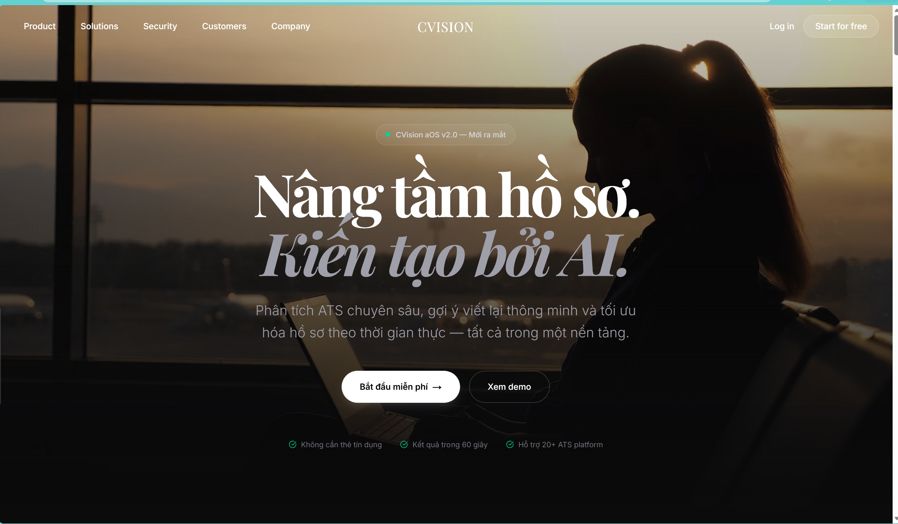
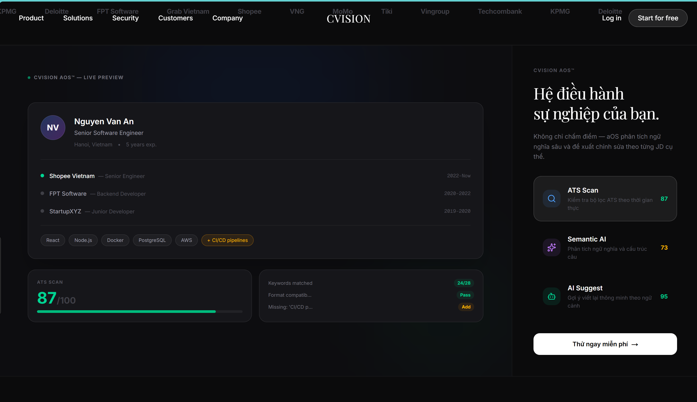
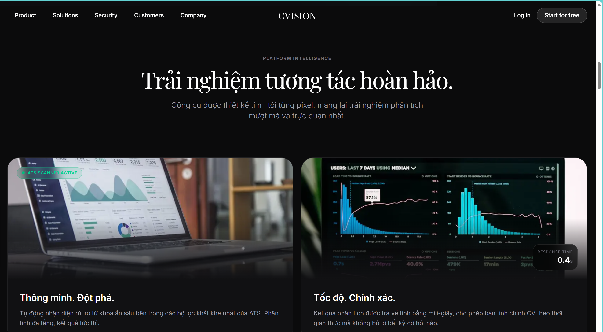
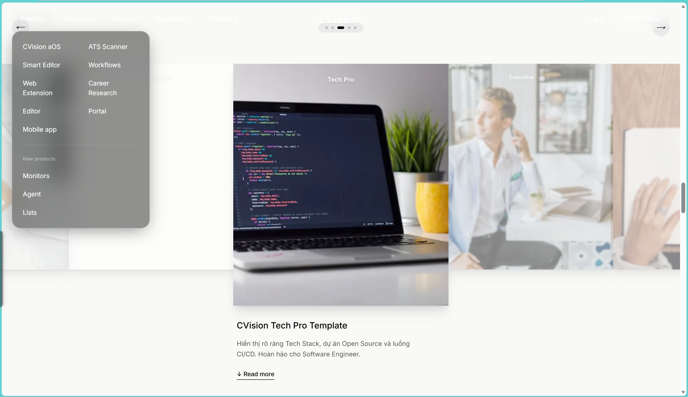
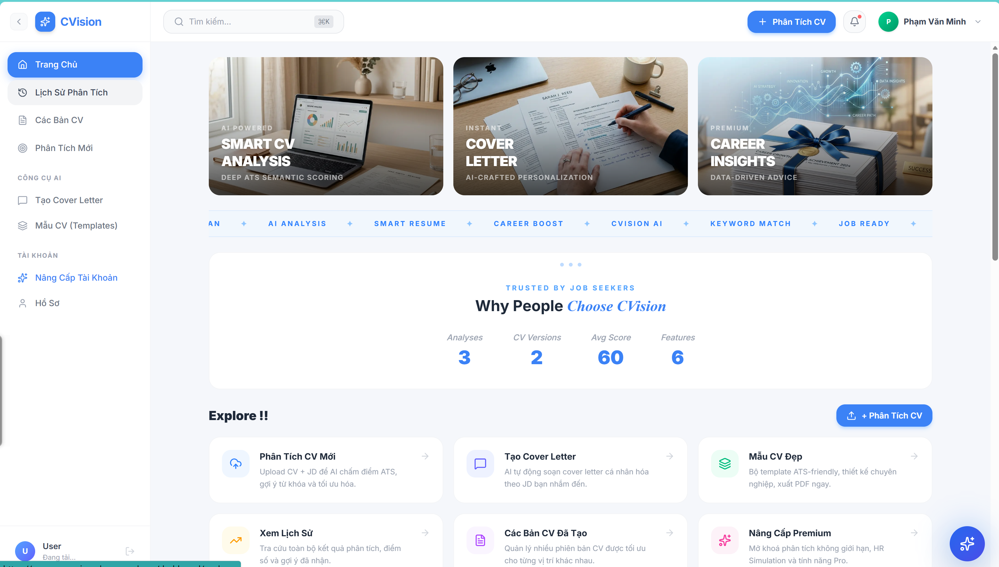
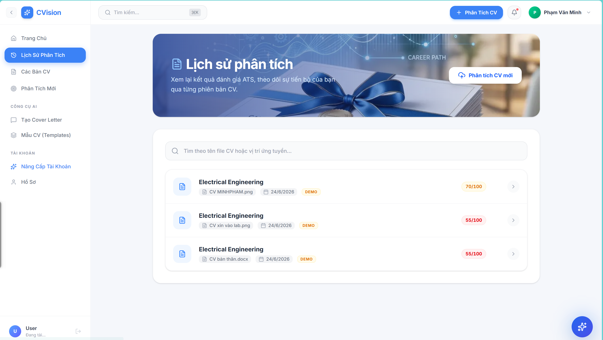
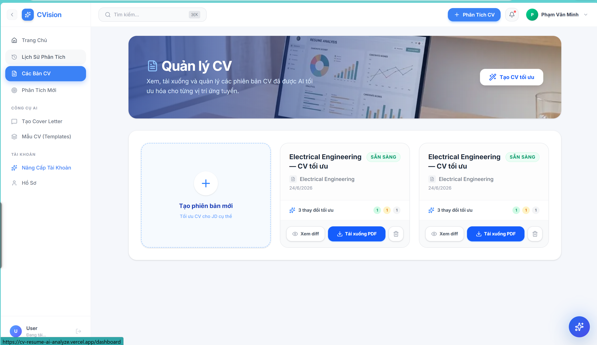
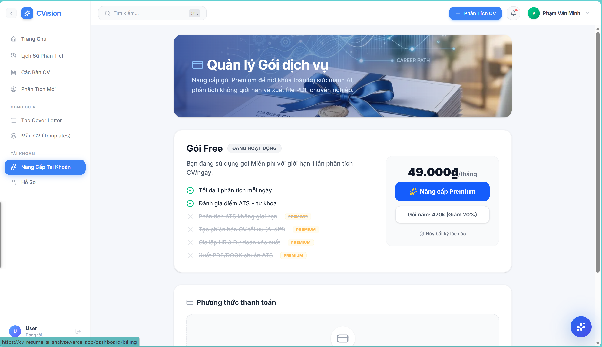
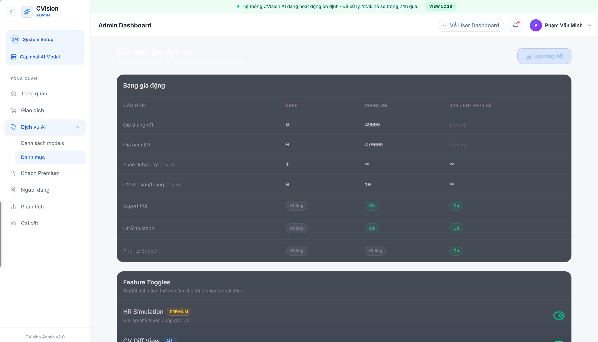

# ✨ CVision AI — AI-Powered Resume & Career Assistant 🚀

<div align="center">
  
  
  
  
  
  
</div>

<br/>

<div align="center">
  <h2>🚀 <a href="https://cvision-app-three.vercel.app/">Live Demo: Trải nghiệm CVision AI ngay tại đây!</a> 🚀</h2>
  <p><i>Trực tiếp trải nghiệm tính năng Phân tích CV & AI Chat mà không cần cài đặt code.</i></p>
</div>

<br/>

**CVision AI** is a state-of-the-art SaaS platform designed to revolutionize the job application process. By leveraging the power of **Google's Gemini Multimodal AI**, this application provides intelligent, context-aware CV analysis, ATS semantic scoring, personalized cover letter generation, and an interactive real-time AI career advisor.

Built with a focus on **Premium UX/UI**, the frontend boasts a sleek Glassmorphism design, fluid Framer Motion micro-animations, and a responsive dashboard that rivals top-tier enterprise SaaS products.

---

## 🔥 Key Features

### 🧠 Deep AI CV Analysis (ATS Scanner)
Upload your CV (PDF/Image/Word) and let the AI scan it against modern Applicant Tracking Systems (ATS). Get detailed scoring across:
- **Total ATS Score**
- **Keyword Matching** & Missing Keywords
- **Content & Layout Optimization**
- **Skills & Achievement Review**

### 💬 Real-time AI Career Assistant
A floating, highly interactive AI Chat Widget integrated directly into the dashboard. Powered by **Gemini 3.1 Flash-Lite**, it serves as an instant career advisor capable of:
- Understanding context from your uploaded CV.
- Generating interview questions based on your profile.
- Providing direct, professional advice.

### 📝 Smart Cover Letter Generator
Automatically craft highly personalized, industry-standard cover letters tailored to specific Job Descriptions (JDs) and your exact CV profile.

### 💼 Premium Dashboard Experience
- **Glassmorphism Aesthetics**: Deep, rich UI with translucent blurs, subtle glows, and dark mode optimizations.
- **Framer Motion Animations**: Smooth page transitions, hover states, and dynamic elements.
- **Version Control for Resumes**: Keep track of different optimized versions of your CV for different roles.

---

## 🛠️ Architecture & Tech Stack

This project is structured as a powerful full-stack monorepo:

### Frontend (`/cvision-app`)
- **Framework**: Next.js 16 (App Router)
- **UI Library**: React 19
- **Styling**: Tailwind CSS + Custom CSS Variables + Lucide React Icons
- **Animations**: Framer Motion
- **Authentication**: Supabase Auth (Google OAuth & Email/Password)
- **State Management**: Zustand / LocalStorage fallbacks
- **Deployment**: Vercel

### Backend (`/backend`)
- **Framework**: FastAPI (Python)
- **AI Integration**: Google GenAI SDK (Gemini REST APIs)
- **Database**: Supabase PostgreSQL
- **Deployment**: Vercel Serverless Functions

---

## 🚀 Getting Started

### 1. Clone the repository
```bash
git clone https://github.com/minhkaiyo/CV_pro.git
cd CV-resume-AI-analyze
```

### 2. Frontend Setup
```bash
cd cvision-app
npm install
```
Create a `.env.local` file in `cvision-app`:
```env
NEXT_PUBLIC_API_URL=http://localhost:8000/api/v1
NEXT_PUBLIC_SUPABASE_URL=your_supabase_url
NEXT_PUBLIC_SUPABASE_ANON_KEY=your_supabase_anon_key
CVISION_GEMINI_KEY=your_gemini_api_key
```
Run the frontend:
```bash
npm run dev
```

### 3. Backend Setup
```bash
cd backend
python -m venv venv
source venv/bin/activate  # Or `venv\Scripts\activate` on Windows
pip install -r requirements.txt
```
Run the backend:
```bash
uvicorn app.main:app --reload
```

---

## 🎨 UI/UX Showcase

*The application features a modern, dark-themed dashboard with animated Glassmorphism panels, providing a truly immersive experience for job seekers.*

<div align="center">
  
  <br/><br/>
  
  <br/><br/>
  
  <br/><br/>
  
  <br/><br/>
  
  <br/><br/>
  
  <br/><br/>
  
  <br/><br/>
  
  <br/><br/>
  
</div>

---

## 👨‍💻 Author

**Phạm Văn Minh**
- **Major**: Electronics & Telecommunications Engineering, HUST (Junior)
- **Focus**: Verilog/FPGA, C/C++ Embedded, Python, IoT, & Modern Web Development.

*This project showcases my ability to architect and build full-stack, AI-integrated SaaS products with a strong emphasis on both cutting-edge backend logic and premium frontend user experience.*
